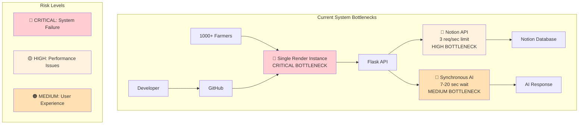
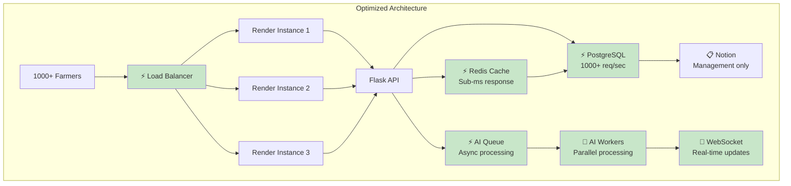
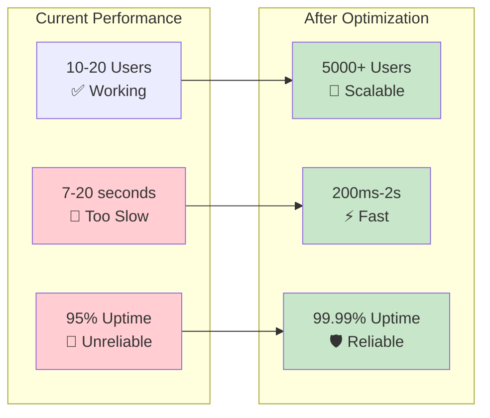
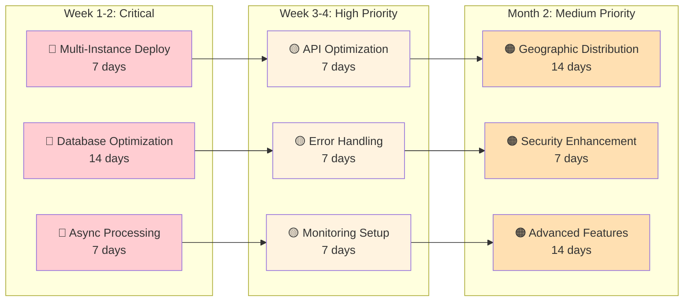

# MAGSASA-CARD Bottlenecks Visual Analysis
## Critical Performance Issues & Solutions

---

## 🚨 **CRITICAL BOTTLENECKS OVERVIEW**

---

## ⚡ **OPTIMIZATION SOLUTIONS OVERVIEW**

---

## 📊 **PERFORMANCE COMPARISON**

---

## 🎯 **OPTIMIZATION PRIORITY ROADMAP**

