# MAGSASA-CARD Development Workflow with Notion Integration
## Systematic Bottleneck Fixes + Progress Tracking

---

## 🎯 **INTEGRATED DEVELOPMENT APPROACH**

### **Core Philosophy**

```mermaid
graph LR
    subgraph "Development Cycle"
        IDENTIFY[🔍 Identify Bottleneck] --> PLAN[📋 Plan in Notion]
        PLAN --> DEVELOP[💻 Develop Locally]
        DEVELOP --> STAGE[🧪 Test in Staging]
        STAGE --> DOCUMENT[📝 Document in Notion]
        DOCUMENT --> DEPLOY[🚀 Deploy to Production]
        DEPLOY --> MONITOR[📊 Monitor & Capture]
        MONITOR --> IDENTIFY
    end
    
    style PLAN fill:#e3f2fd
    style DOCUMENT fill:#e3f2fd
    style MONITOR fill:#e3f2fd
```


**Every fix follows this cycle, ensuring we capture progress and maintain quality at each stage.**

---

## 🏗️ **ENVIRONMENT SETUP STRATEGY**

### **Three-Tier Environment Architecture**

```mermaid
graph TB
    subgraph "Development Environment"
        LOCAL[💻 Local Development<br/>localhost:5000]
        LOCAL_DB[🗄️ Local SQLite<br/>Fast iteration]
        LOCAL_NOTION[📋 Notion Dev Workspace<br/>Task tracking]
    end
    
    subgraph "Staging Environment"
        STAGING[🧪 Staging Server<br/>staging.magsasa-card.com]
        STAGING_DB[🗄️ Staging PostgreSQL<br/>Production-like data]
        STAGING_NOTION[📋 Notion Staging Workspace<br/>Testing documentation]
    end
    
    subgraph "Production Environment"
        PRODUCTION[🚀 Production Server<br/>magsasa-card-api-staging.onrender.com]
        PROD_DB[🗄️ Production PostgreSQL<br/>Live farmer data]
        PROD_NOTION[📋 Notion Production Workspace<br/>Live documentation]
    end
    
    LOCAL --> STAGING
    STAGING --> PRODUCTION
    
    LOCAL_NOTION --> STAGING_NOTION
    STAGING_NOTION --> PROD_NOTION
    
    style LOCAL fill:#c8e6c9
    style STAGING fill:#fff3e0
    style PRODUCTION fill:#ffcdd2
```


---

## 📋 **NOTION WORKSPACE INTEGRATION**

### **Enhanced Notion Database Structure**

```mermaid
graph TB
    subgraph "AgSense ERP (CARD MRI Pilot)"
        MAIN[🏠 Main Dashboard]
    end
    
    subgraph "Development Tracking"
        BOTTLENECKS[🚨 Bottlenecks Registry<br/>Track all performance issues]
        FIXES[🔧 Optimization Fixes<br/>Implementation progress]
        TESTING[🧪 Testing Results<br/>Stage validation]
        DEPLOYMENTS[🚀 Deployment Log<br/>Production releases]
    end
    
    subgraph "Existing Databases"
        AI_REGISTRY[🤖 AI Agents Registry]
        ANALYTICS[📊 Performance Analytics]
        KNOWLEDGE[🌾 Agricultural Knowledge]
        FARMERS[👨‍🌾 Farmers Database]
    end
    
    subgraph "Documentation Hub"
        ARCHITECTURE[🏗️ Architecture Docs<br/>System design]
        WORKFLOWS[⚙️ Workflow Docs<br/>Process documentation]
        PROGRESS[📈 Progress Reports<br/>Weekly updates]
    end
    
    MAIN --> BOTTLENECKS
    MAIN --> FIXES
    MAIN --> TESTING
    MAIN --> DEPLOYMENTS
    
    BOTTLENECKS --> FIXES
    FIXES --> TESTING
    TESTING --> DEPLOYMENTS
    
    style BOTTLENECKS fill:#ffcdd2
    style FIXES fill:#fff3e0
    style TESTING fill:#e8f5e8
    style DEPLOYMENTS fill:#e3f2fd
```


---

## 🔄 **SYSTEMATIC BOTTLENECK FIX WORKFLOW**

### **Phase 1: Critical Bottlenecks (Week 1-2)**

#### **Fix 1: Multi-Instance Deployment**

```mermaid
sequenceDiagram
    participant DEV as 👨‍💻 Developer
    participant NOTION as 📋 Notion
    participant LOCAL as 💻 Local
    participant STAGING as 🧪 Staging
    participant PROD as 🚀 Production
    
    DEV->>NOTION: Create "Multi-Instance Deploy" task
    DEV->>LOCAL: Implement load balancer config
    LOCAL->>DEV: Test locally (multiple processes)
    DEV->>NOTION: Update progress "Local testing complete"
    
    DEV->>STAGING: Deploy to staging environment
    STAGING->>DEV: Validate load balancing
    DEV->>NOTION: Document staging results
    
    DEV->>PROD: Deploy to production
    PROD->>DEV: Monitor performance metrics
    DEV->>NOTION: Document production metrics
    DEV->>NOTION: Mark task "Complete" with results
```


**Notion Task Template**:
```markdown
# 🔧 Multi-Instance Deployment Fix

## Problem
- Single point of failure on Render
- Risk: Complete system outage if instance fails

## Solution Approach
- [ ] Configure load balancer locally
- [ ] Test with multiple Flask processes
- [ ] Deploy to staging with 2 instances
- [ ] Validate failover behavior
- [ ] Deploy to production with 3 instances
- [ ] Monitor uptime improvement

## Progress Tracking
- **Started**: [Date]
- **Local Complete**: [Date]
- **Staging Complete**: [Date]
- **Production Complete**: [Date]

## Results
- **Before**: 95% uptime, single instance
- **After**: [To be measured]
- **Performance Impact**: [To be documented]

## Documentation Links
- Architecture diagram: [Link]
- Configuration files: [GitHub links]
- Monitoring dashboard: [Link]
```

#### **Fix 2: Database Optimization**
**Local → Staging → Production Pipeline**:

1. **Local Development** (2 days):
   - Add PostgreSQL container with Docker
   - Implement data migration scripts
   - Test with sample farmer data
   - Document in Notion: "Local PostgreSQL Setup Complete"

2. **Staging Deployment** (2 days):
   - Deploy PostgreSQL on staging
   - Migrate Notion data to PostgreSQL
   - Performance testing with load simulation
   - Document in Notion: "Staging Performance Results"

3. **Production Deployment** (3 days):
   - Production PostgreSQL setup
   - Data migration strategy
   - Gradual rollout with monitoring
   - Document in Notion: "Production Migration Complete"

#### **Fix 3: Async Processing**
**Implementation with Documentation**:

1. **Local Implementation**:
   ```python
   # Add to local development
   from celery import Celery
   from redis import Redis
   
   # Document in Notion: Code snippets and architecture
   ```

2. **Staging Validation**:
   - Deploy Redis and Celery workers
   - Test AI processing queue
   - Measure response time improvements
   - Document results in Notion

3. **Production Rollout**:
   - Production Redis deployment
   - Monitor queue performance
   - Document farmer experience improvements

---

## 📊 **NOTION PROGRESS TRACKING SYSTEM**

### **Bottlenecks Registry Database**
| Field | Type | Purpose |
|-------|------|---------|
| **Bottleneck Name** | Title | "Single Point of Failure" |
| **Severity** | Select | Critical/High/Medium |
| **Impact** | Text | "System outage risk" |
| **Status** | Select | Not Started/In Progress/Testing/Complete |
| **Assigned To** | Person | Developer responsible |
| **Start Date** | Date | When work began |
| **Target Date** | Date | Expected completion |
| **Environment** | Multi-select | Local/Staging/Production |
| **Performance Before** | Text | Baseline metrics |
| **Performance After** | Text | Improvement metrics |
| **Documentation** | URL | Links to detailed docs |

### **Optimization Fixes Database**
| Field | Type | Purpose |
|-------|------|---------|
| **Fix Title** | Title | "Multi-Instance Deployment" |
| **Related Bottleneck** | Relation | Link to bottleneck |
| **Implementation Status** | Select | Planning/Development/Testing/Deployed |
| **Local Status** | Checkbox | ✅ Complete |
| **Staging Status** | Checkbox | ✅ Complete |
| **Production Status** | Checkbox | ✅ Complete |
| **Code Repository** | URL | GitHub branch/PR links |
| **Performance Metrics** | Text | Before/after measurements |
| **Lessons Learned** | Text | What worked/didn't work |

### **Testing Results Database**
| Field | Type | Purpose |
|-------|------|---------|
| **Test Name** | Title | "Load Balancer Failover Test" |
| **Environment** | Select | Local/Staging/Production |
| **Test Date** | Date | When test was performed |
| **Test Results** | Select | Pass/Fail/Partial |
| **Performance Data** | Text | Response times, throughput |
| **Issues Found** | Text | Problems discovered |
| **Next Steps** | Text | Required actions |

---

## 🚀 **AUTOMATED NOTION INTEGRATION**

### **GitHub Actions → Notion Automation**
```yaml
# .github/workflows/notion-sync.yml
name: Sync Progress to Notion

on:
  push:
    branches: [main, staging, development]
  pull_request:
    branches: [main]

jobs:
  notion-sync:
    runs-on: ubuntu-latest
    steps:
      - name: Update Notion Task
        uses: notion-api/notion-update@v1
        with:
          notion-token: ${{ secrets.NOTION_TOKEN }}
          database-id: ${{ secrets.BOTTLENECKS_DB_ID }}
          update-data: |
            {
              "Status": "In Progress",
              "Last Updated": "{{ github.event.head_commit.timestamp }}",
              "Commit": "{{ github.event.head_commit.message }}"
            }
```

### **Automated Documentation Generation**
```python
# scripts/generate_notion_docs.py
import requests
import json
from datetime import datetime

def update_notion_progress(bottleneck_id, status, metrics):
    """Update Notion database with progress"""
    notion_api = "https://api.notion.com/v1/pages/{bottleneck_id}"
    
    payload = {
        "properties": {
            "Status": {"select": {"name": status}},
            "Performance After": {"rich_text": [{"text": {"content": metrics}}]},
            "Last Updated": {"date": {"start": datetime.now().isoformat()}}
        }
    }
    
    # Update Notion page
    response = requests.patch(notion_api, json=payload)
    return response.json()
```

---

## 📈 **PROGRESS MEASUREMENT & REPORTING**

### **Weekly Progress Reports (Automated)**
```markdown
# MAGSASA-CARD Weekly Progress Report
**Week of**: [Auto-generated date]

## 🎯 Bottlenecks Addressed This Week
- ✅ Multi-Instance Deployment (Critical) - **COMPLETE**
  - Before: 95% uptime, single instance
  - After: 99.5% uptime, 3 instances with load balancer
  - Impact: Eliminated single point of failure

- 🔄 Database Optimization (Critical) - **IN PROGRESS**
  - Local: ✅ Complete
  - Staging: 🔄 Testing
  - Production: ⏳ Pending

## 📊 Performance Improvements
- **Response Time**: 7-20s → 2-5s (65% improvement)
- **Concurrent Users**: 10-20 → 50-100 (400% improvement)
- **Uptime**: 95% → 99.5% (4.5% improvement)

## 🚀 Next Week Priorities
- Complete database optimization production deployment
- Begin async processing implementation
- Start API optimization planning

## 🔗 Documentation Links
- [Architecture Updates](notion-link)
- [Performance Metrics](notion-link)
- [Code Repository](github-link)
```

---

## 🎯 **IMPLEMENTATION TIMELINE WITH NOTION**

### **Week 1: Setup & Critical Fix #1**
**Monday-Tuesday**: Environment Setup
- [ ] Create Notion databases (Bottlenecks, Fixes, Testing, Deployments)
- [ ] Set up staging environment
- [ ] Configure GitHub Actions → Notion sync
- [ ] Document baseline performance metrics

**Wednesday-Friday**: Multi-Instance Deployment
- [ ] Local development and testing
- [ ] Staging deployment and validation
- [ ] Production deployment
- [ ] Performance monitoring and documentation

### **Week 2: Critical Fix #2 & #3**
**Monday-Wednesday**: Database Optimization
- [ ] Local PostgreSQL implementation
- [ ] Staging deployment and testing
- [ ] Production migration planning

**Thursday-Friday**: Async Processing
- [ ] Local Celery/Redis setup
- [ ] Staging deployment
- [ ] Initial performance testing

### **Week 3-4: High Priority Optimizations**
- API optimization with caching
- Error handling and resilience
- Monitoring and alerting setup
- All progress documented in Notion

---

## 💡 **IMMEDIATE NEXT STEPS (Today)**

### **1. Set Up Notion Integration (30 minutes)**
```bash
# Create Notion integration
1. Go to https://notion.so/my-integrations
2. Create "MAGSASA-CARD Development" integration
3. Get integration token
4. Add to GitHub secrets as NOTION_TOKEN
```

### **2. Create Notion Databases (45 minutes)**
- **Bottlenecks Registry**: Track all performance issues
- **Optimization Fixes**: Implementation progress
- **Testing Results**: Stage validation results
- **Deployment Log**: Production releases

### **3. Set Up Staging Environment (2 hours)**
```bash
# Create staging branch
git checkout -b staging
git push origin staging

# Deploy to separate Render instance
# Configure staging.magsasa-card.com subdomain
```

### **4. Implement First Fix (4 hours)**
- Multi-instance deployment
- Document everything in Notion
- Test in staging before production

---

## 🎊 **BENEFITS OF THIS APPROACH**

### **For Development Team**
- **Complete Visibility**: Every fix tracked from start to finish
- **Quality Assurance**: Staging validation prevents production issues
- **Knowledge Retention**: All decisions and results documented
- **Automated Reporting**: Progress reports generated automatically

### **For Stakeholders (CARD MRI)**
- **Real-time Progress**: Live dashboard of optimization work
- **Performance Metrics**: Clear before/after measurements
- **Risk Management**: Staging environment prevents production issues
- **Documentation**: Complete audit trail of all improvements

### **For Future Development**
- **Reproducible Process**: Clear workflow for future optimizations
- **Historical Data**: Performance trends and improvement patterns
- **Best Practices**: Documented lessons learned
- **Scalable Approach**: Process works for any size optimization

---

## 🚀 **EXPECTED OUTCOMES**

### **After 2 Weeks**
- **3 Critical bottlenecks fixed** with full documentation
- **Staging environment** operational for safe testing
- **Notion integration** capturing all progress automatically
- **Performance improvements** measured and documented

### **After 1 Month**
- **Complete optimization roadmap** implemented
- **5000+ farmer capacity** with documented performance
- **Automated workflow** for future improvements
- **Comprehensive documentation** for team scaling

**This approach ensures we fix bottlenecks systematically while building a robust development process that scales with your growing team and farmer base.**

Would you like to start with the 30-minute Notion integration setup, or would you prefer to begin with the staging environment configuration?
