# MAGSASA-CARD Technology Architecture Map
## Complete Visual Integration Overview

---

## 🏗️ **SYSTEM ARCHITECTURE OVERVIEW**

```mermaid
graph TB
    subgraph "Development Environment"
        DEV[👨‍💻 Developer]
        CURSOR[🎯 Cursor IDE]
        MANUS[🤖 Manus AI]
    end

    subgraph "Version Control & CI/CD"
        GITHUB[📚 GitHub Repository<br/>gerome650/magsasa-card-backend]
        ACTIONS[⚙️ GitHub Actions<br/>Automated Workflows]
        RENDER[🚀 Render Deployment<br/>magsasa-card-api-staging.onrender.com]
    end

    subgraph "Production API Layer"
        API[🌐 Flask API Server<br/>Python 3.13.4 + Gunicorn]
        HEALTH[💚 Health Endpoints<br/>/api/health]
        PRICING[💰 Pricing Engine<br/>/api/pricing/health]
        KAANI[🧠 KaAni AI<br/>/api/kaani/health]
    end

    subgraph "Data & Knowledge Management"
        NOTION[📋 Notion Workspace<br/>AgSense ERP (CARD MRI Pilot)]
        AIREGISTRY[🤖 AI Agents Registry]
        ANALYTICS[📊 Performance Analytics]
        KNOWLEDGE[🌾 Agricultural Knowledge]
        FARMERS[👨‍🌾 Farmers Database]
        SPECS[📋 Specs & Roadmap]
    end

    subgraph "AI & Intelligence Layer"
        OPENAI[🧠 OpenAI GPT-4<br/>Agricultural Intelligence]
        NOTIONAI[🤖 Notion AI Agents<br/>Smart Automation]
        PREDICTIONS[📈 Predictive Analytics<br/>Crop & Market Forecasting]
    end

    subgraph "Automation & Integration"
        ZAPIER[🔗 Zapier<br/>No-Code Automation]
        N8N[⚡ n8n Workflows<br/>Complex Automation]
        WEBHOOKS[🔔 Webhooks<br/>Real-time Sync]
    end

    subgraph "External Partners"
        CARDMRI[🏦 CARD MRI<br/>Financial Services]
        SUPPLIERS[🌱 Input Suppliers<br/>Seeds, Fertilizers]
        LOGISTICS[🚛 Logistics Partners<br/>Transportation]
        BUYERS[🏪 Buyers/Processors<br/>Market Access]
    end

    %% Development Flow
    DEV --> CURSOR
    CURSOR --> MANUS
    MANUS --> GITHUB
    
    %% CI/CD Pipeline
    GITHUB --> ACTIONS
    ACTIONS --> RENDER
    RENDER --> API
    
    %% API Services
    API --> HEALTH
    API --> PRICING
    API --> KAANI
    
    %% Data Integration
    ACTIONS --> NOTION
    NOTION --> AIREGISTRY
    NOTION --> ANALYTICS
    NOTION --> KNOWLEDGE
    NOTION --> FARMERS
    NOTION --> SPECS
    
    %% AI Integration
    KAANI --> OPENAI
    NOTION --> NOTIONAI
    ANALYTICS --> PREDICTIONS
    
    %% Automation Layer
    GITHUB --> ZAPIER
    NOTION --> ZAPIER
    ZAPIER --> N8N
    RENDER --> WEBHOOKS
    WEBHOOKS --> NOTION
    
    %% External Integrations
    API --> CARDMRI
    FARMERS --> SUPPLIERS
    PRICING --> LOGISTICS
    ANALYTICS --> BUYERS

    %% Styling
    classDef development fill:#e1f5fe
    classDef cicd fill:#f3e5f5
    classDef production fill:#e8f5e8
    classDef data fill:#fff3e0
    classDef ai fill:#fce4ec
    classDef automation fill:#f1f8e9
    classDef external fill:#fafafa

    class DEV,CURSOR,MANUS development
    class GITHUB,ACTIONS,RENDER cicd
    class API,HEALTH,PRICING,KAANI production
    class NOTION,AIREGISTRY,ANALYTICS,KNOWLEDGE,FARMERS,SPECS data
    class OPENAI,NOTIONAI,PREDICTIONS ai
    class ZAPIER,N8N,WEBHOOKS automation
    class CARDMRI,SUPPLIERS,LOGISTICS,BUYERS external
```

---

## 🔄 **DATA FLOW ARCHITECTURE**

```mermaid
flowchart LR
    subgraph "Input Sources"
        FARMER_DATA[👨‍🌾 Farmer Profiles]
        CROP_DATA[🌾 Crop Information]
        MARKET_DATA[📈 Market Prices]
        WEATHER_DATA[🌤️ Weather Data]
    end

    subgraph "Processing Layer"
        API_GATEWAY[🌐 API Gateway<br/>Flask Application]
        AI_ENGINE[🧠 AI Processing<br/>OpenAI + Custom Models]
        PRICING_ENGINE[💰 Dynamic Pricing<br/>CARD Member Benefits]
        RISK_ENGINE[⚠️ Risk Assessment<br/>AgScore System]
    end

    subgraph "Intelligence Layer"
        CROP_AI[🌱 Crop Diagnosis AI<br/>KaAni System]
        MARKET_AI[📊 Market Analysis AI<br/>Price Predictions]
        LOAN_AI[💳 Loan Assessment AI<br/>CARD MRI Integration]
        LOGISTICS_AI[🚛 Logistics Optimization<br/>Delivery Planning]
    end

    subgraph "Storage & Management"
        NOTION_DB[(📋 Notion Databases<br/>Structured Data)]
        KNOWLEDGE_BASE[(📚 Knowledge Base<br/>Agricultural Wisdom)]
        ANALYTICS_DB[(📊 Analytics Store<br/>Performance Metrics)]
    end

    subgraph "Output Channels"
        FARMER_APP[📱 Farmer Interface<br/>Mobile/Web App]
        ADMIN_DASH[🖥️ Admin Dashboard<br/>Management Interface]
        PARTNER_API[🔗 Partner APIs<br/>External Integrations]
        REPORTS[📄 Reports & Analytics<br/>Business Intelligence]
    end

    %% Data Flow
    FARMER_DATA --> API_GATEWAY
    CROP_DATA --> API_GATEWAY
    MARKET_DATA --> API_GATEWAY
    WEATHER_DATA --> API_GATEWAY

    API_GATEWAY --> AI_ENGINE
    API_GATEWAY --> PRICING_ENGINE
    API_GATEWAY --> RISK_ENGINE

    AI_ENGINE --> CROP_AI
    AI_ENGINE --> MARKET_AI
    AI_ENGINE --> LOAN_AI
    AI_ENGINE --> LOGISTICS_AI

    CROP_AI --> NOTION_DB
    MARKET_AI --> KNOWLEDGE_BASE
    LOAN_AI --> ANALYTICS_DB
    LOGISTICS_AI --> NOTION_DB

    NOTION_DB --> FARMER_APP
    KNOWLEDGE_BASE --> ADMIN_DASH
    ANALYTICS_DB --> PARTNER_API
    NOTION_DB --> REPORTS

    %% Styling
    classDef input fill:#e3f2fd
    classDef processing fill:#f1f8e9
    classDef intelligence fill:#fce4ec
    classDef storage fill:#fff3e0
    classDef output fill:#e8f5e8

    class FARMER_DATA,CROP_DATA,MARKET_DATA,WEATHER_DATA input
    class API_GATEWAY,AI_ENGINE,PRICING_ENGINE,RISK_ENGINE processing
    class CROP_AI,MARKET_AI,LOAN_AI,LOGISTICS_AI intelligence
    class NOTION_DB,KNOWLEDGE_BASE,ANALYTICS_DB storage
    class FARMER_APP,ADMIN_DASH,PARTNER_API,REPORTS output
```



---

## 🔧 **INTEGRATION WORKFLOW MAP**

```mermaid
sequenceDiagram
    participant DEV as 👨‍💻 Developer
    participant CURSOR as 🎯 Cursor IDE
    participant GITHUB as 📚 GitHub
    participant ACTIONS as ⚙️ GitHub Actions
    participant RENDER as 🚀 Render
    participant API as 🌐 Flask API
    participant NOTION as 📋 Notion
    participant AI as 🧠 AI Agents
    participant FARMER as 👨‍🌾 Farmer

    DEV->>CURSOR: Write Code with AI Assistance
    CURSOR->>GITHUB: Commit & Push Changes
    GITHUB->>ACTIONS: Trigger Automation
    ACTIONS->>RENDER: Deploy to Production
    ACTIONS->>NOTION: Create/Update Tasks
    
    RENDER->>API: Start Flask Application
    API->>NOTION: Sync Data & Status
    
    FARMER->>API: Request Crop Diagnosis
    API->>AI: Process with OpenAI
    AI->>NOTION: Store Analysis Results
    NOTION->>AI: Trigger Smart Recommendations
    AI->>API: Return AI Insights
    API->>FARMER: Deliver Personalized Advice
    
    NOTION->>ACTIONS: Webhook on Data Update
    ACTIONS->>RENDER: Trigger Redeployment if Needed
    
    Note over DEV,FARMER: Continuous Integration & AI-Powered Agriculture
```



---

## 🏢 **ORGANIZATIONAL ARCHITECTURE**

```mermaid
graph TD
    subgraph "CARD MRI Organization"
        CARDMRI_ADMIN[🏦 CARD MRI Admin<br/>System Oversight]
        FIELD_OFFICERS[👥 Field Officers<br/>Farmer Support]
        LOAN_OFFICERS[💼 Loan Officers<br/>Financial Assessment]
    end

    subgraph "Farmer Network"
        FARMERS_INDIVIDUAL[👨‍🌾 Individual Farmers<br/>Direct Users]
        FARMERS_COOP[🤝 Farmer Cooperatives<br/>Group Management]
        FARMERS_ASSOC[🏘️ Farmer Associations<br/>Community Level]
    end

    subgraph "Technology Stack"
        MAGSASA_PLATFORM[🌾 MAGSASA-CARD Platform<br/>Central Hub]
        NOTION_WORKSPACE[📋 Notion Workspace<br/>Data Management]
        AI_SERVICES[🧠 AI Services<br/>Intelligence Layer]
    end

    subgraph "Partner Ecosystem"
        INPUT_SUPPLIERS[🌱 Input Suppliers<br/>Seeds, Fertilizers, Equipment]
        LOGISTICS_PARTNERS[🚛 Logistics Partners<br/>Transportation & Storage]
        BUYERS_PROCESSORS[🏪 Buyers & Processors<br/>Market Access]
        INSURANCE_PROVIDERS[🛡️ Insurance Providers<br/>Risk Management]
    end

    subgraph "External Systems"
        WEATHER_SERVICES[🌤️ Weather Services<br/>Climate Data]
        MARKET_DATA[📈 Market Data Providers<br/>Price Information]
        GOVERNMENT_SYSTEMS[🏛️ Government Systems<br/>Regulatory Compliance]
    end

    %% Organizational Relationships
    CARDMRI_ADMIN --> MAGSASA_PLATFORM
    FIELD_OFFICERS --> FARMERS_INDIVIDUAL
    LOAN_OFFICERS --> AI_SERVICES
    
    FARMERS_INDIVIDUAL --> MAGSASA_PLATFORM
    FARMERS_COOP --> NOTION_WORKSPACE
    FARMERS_ASSOC --> AI_SERVICES
    
    MAGSASA_PLATFORM --> NOTION_WORKSPACE
    NOTION_WORKSPACE --> AI_SERVICES
    
    AI_SERVICES --> INPUT_SUPPLIERS
    MAGSASA_PLATFORM --> LOGISTICS_PARTNERS
    NOTION_WORKSPACE --> BUYERS_PROCESSORS
    AI_SERVICES --> INSURANCE_PROVIDERS
    
    MAGSASA_PLATFORM --> WEATHER_SERVICES
    AI_SERVICES --> MARKET_DATA
    NOTION_WORKSPACE --> GOVERNMENT_SYSTEMS

    %% Styling
    classDef cardmri fill:#1976d2,color:#fff
    classDef farmers fill:#388e3c,color:#fff
    classDef tech fill:#f57c00,color:#fff
    classDef partners fill:#7b1fa2,color:#fff
    classDef external fill:#455a64,color:#fff

    class CARDMRI_ADMIN,FIELD_OFFICERS,LOAN_OFFICERS cardmri
    class FARMERS_INDIVIDUAL,FARMERS_COOP,FARMERS_ASSOC farmers
    class MAGSASA_PLATFORM,NOTION_WORKSPACE,AI_SERVICES tech
    class INPUT_SUPPLIERS,LOGISTICS_PARTNERS,BUYERS_PROCESSORS,INSURANCE_PROVIDERS partners
    class WEATHER_SERVICES,MARKET_DATA,GOVERNMENT_SYSTEMS external
```



---

## 📊 **TECHNOLOGY STACK LAYERS**

```mermaid
graph TB
    subgraph "Presentation Layer"
        WEB_APP[🌐 Web Application<br/>React Frontend]
        MOBILE_APP[📱 Mobile App<br/>Progressive Web App]
        ADMIN_PANEL[🖥️ Admin Panel<br/>Management Interface]
    end

    subgraph "API Gateway Layer"
        FLASK_API[🐍 Flask API<br/>Python 3.13.4]
        REST_ENDPOINTS[🔗 REST Endpoints<br/>JSON API]
        CORS_CONFIG[🌍 CORS Configuration<br/>Cross-Origin Support]
    end

    subgraph "Business Logic Layer"
        PRICING_SERVICE[💰 Dynamic Pricing Service<br/>CARD Member Benefits]
        KAANI_SERVICE[🧠 KaAni AI Service<br/>Crop Diagnosis]
        LOGISTICS_SERVICE[🚛 Logistics Service<br/>Delivery Optimization]
        RISK_SERVICE[⚠️ Risk Assessment<br/>AgScore System]
    end

    subgraph "Integration Layer"
        NOTION_API[📋 Notion API<br/>Data Synchronization]
        OPENAI_API[🤖 OpenAI API<br/>AI Processing]
        GITHUB_API[📚 GitHub API<br/>Version Control]
        WEBHOOK_HANDLERS[🔔 Webhook Handlers<br/>Real-time Events]
    end

    subgraph "Data Layer"
        NOTION_DATABASES[📊 Notion Databases<br/>Structured Storage]
        KNOWLEDGE_BASE[📚 Knowledge Base<br/>Agricultural Data]
        CACHE_LAYER[⚡ Cache Layer<br/>Performance Optimization]
    end

    subgraph "Infrastructure Layer"
        RENDER_HOSTING[🚀 Render Hosting<br/>Cloud Platform]
        GUNICORN_SERVER[⚙️ Gunicorn Server<br/>WSGI Application Server]
        MONITORING[📈 Monitoring & Logging<br/>System Health]
    end

    subgraph "Development Tools"
        CURSOR_IDE[🎯 Cursor IDE<br/>AI-Powered Development]
        MANUS_AI[🤖 Manus AI<br/>Development Assistant]
        GITHUB_ACTIONS[⚙️ GitHub Actions<br/>CI/CD Pipeline]
    end

    %% Layer Connections
    WEB_APP --> FLASK_API
    MOBILE_APP --> REST_ENDPOINTS
    ADMIN_PANEL --> CORS_CONFIG

    FLASK_API --> PRICING_SERVICE
    REST_ENDPOINTS --> KAANI_SERVICE
    CORS_CONFIG --> LOGISTICS_SERVICE
    FLASK_API --> RISK_SERVICE

    PRICING_SERVICE --> NOTION_API
    KAANI_SERVICE --> OPENAI_API
    LOGISTICS_SERVICE --> GITHUB_API
    RISK_SERVICE --> WEBHOOK_HANDLERS

    NOTION_API --> NOTION_DATABASES
    OPENAI_API --> KNOWLEDGE_BASE
    GITHUB_API --> CACHE_LAYER

    NOTION_DATABASES --> RENDER_HOSTING
    KNOWLEDGE_BASE --> GUNICORN_SERVER
    CACHE_LAYER --> MONITORING

    CURSOR_IDE --> GITHUB_ACTIONS
    MANUS_AI --> GITHUB_ACTIONS
    GITHUB_ACTIONS --> RENDER_HOSTING

    %% Styling
    classDef presentation fill:#e3f2fd
    classDef api fill:#f1f8e9
    classDef business fill:#fce4ec
    classDef integration fill:#fff3e0
    classDef data fill:#e8f5e8
    classDef infrastructure fill:#fafafa
    classDef development fill:#f3e5f5

    class WEB_APP,MOBILE_APP,ADMIN_PANEL presentation
    class FLASK_API,REST_ENDPOINTS,CORS_CONFIG api
    class PRICING_SERVICE,KAANI_SERVICE,LOGISTICS_SERVICE,RISK_SERVICE business
    class NOTION_API,OPENAI_API,GITHUB_API,WEBHOOK_HANDLERS integration
    class NOTION_DATABASES,KNOWLEDGE_BASE,CACHE_LAYER data
    class RENDER_HOSTING,GUNICORN_SERVER,MONITORING infrastructure
    class CURSOR_IDE,MANUS_AI,GITHUB_ACTIONS development
```



---

## 🔄 **AUTOMATION WORKFLOW MAP**

```mermaid
graph LR
    subgraph "Development Triggers"
        CODE_COMMIT[💻 Code Commit]
        DEPLOYMENT[🚀 Deployment]
        TASK_COMPLETE[✅ Task Complete]
    end

    subgraph "Automation Hub"
        GITHUB_ACTIONS[⚙️ GitHub Actions]
        ZAPIER[🔗 Zapier]
        N8N[⚡ n8n]
        WEBHOOKS[🔔 Webhooks]
    end

    subgraph "Notion Updates"
        TASK_CREATION[📝 Task Creation]
        STATUS_UPDATE[📊 Status Update]
        KNOWLEDGE_SYNC[📚 Knowledge Sync]
        ANALYTICS_UPDATE[📈 Analytics Update]
    end

    subgraph "AI Triggers"
        FARMER_ANALYSIS[👨‍🌾 Farmer Analysis]
        CROP_RECOMMENDATIONS[🌾 Crop Recommendations]
        MARKET_INSIGHTS[📈 Market Insights]
        RISK_ASSESSMENT[⚠️ Risk Assessment]
    end

    subgraph "Notifications"
        SLACK_ALERTS[💬 Slack Alerts]
        EMAIL_REPORTS[📧 Email Reports]
        DASHBOARD_UPDATES[📊 Dashboard Updates]
        MOBILE_PUSH[📱 Mobile Push]
    end

    %% Automation Flow
    CODE_COMMIT --> GITHUB_ACTIONS
    DEPLOYMENT --> WEBHOOKS
    TASK_COMPLETE --> ZAPIER

    GITHUB_ACTIONS --> TASK_CREATION
    WEBHOOKS --> STATUS_UPDATE
    ZAPIER --> KNOWLEDGE_SYNC
    N8N --> ANALYTICS_UPDATE

    TASK_CREATION --> FARMER_ANALYSIS
    STATUS_UPDATE --> CROP_RECOMMENDATIONS
    KNOWLEDGE_SYNC --> MARKET_INSIGHTS
    ANALYTICS_UPDATE --> RISK_ASSESSMENT

    FARMER_ANALYSIS --> SLACK_ALERTS
    CROP_RECOMMENDATIONS --> EMAIL_REPORTS
    MARKET_INSIGHTS --> DASHBOARD_UPDATES
    RISK_ASSESSMENT --> MOBILE_PUSH

    %% Cross-connections
    GITHUB_ACTIONS --> N8N
    ZAPIER --> WEBHOOKS
    N8N --> GITHUB_ACTIONS

    %% Styling
    classDef triggers fill:#e3f2fd
    classDef automation fill:#f1f8e9
    classDef notion fill:#fff3e0
    classDef ai fill:#fce4ec
    classDef notifications fill:#e8f5e8

    class CODE_COMMIT,DEPLOYMENT,TASK_COMPLETE triggers
    class GITHUB_ACTIONS,ZAPIER,N8N,WEBHOOKS automation
    class TASK_CREATION,STATUS_UPDATE,KNOWLEDGE_SYNC,ANALYTICS_UPDATE notion
    class FARMER_ANALYSIS,CROP_RECOMMENDATIONS,MARKET_INSIGHTS,RISK_ASSESSMENT ai
    class SLACK_ALERTS,EMAIL_REPORTS,DASHBOARD_UPDATES,MOBILE_PUSH notifications
```



---

## 📋 **CURRENT STATUS SUMMARY**

### ✅ **IMPLEMENTED & WORKING**
- **Production API**: https://magsasa-card-api-staging.onrender.com
- **GitHub Repository**: gerome650/magsasa-card-backend
- **Render Deployment**: Auto-deployment from GitHub main branch
- **Flask Application**: Python 3.13.4 with Gunicorn
- **API Endpoints**: Health, Pricing, KaAni AI services
- **Notion Workspace**: AgSense ERP with structured databases

### 🔄 **READY FOR INTEGRATION**
- **Notion API**: Databases configured, integration token needed
- **GitHub Actions**: Repository ready for workflow automation
- **Cursor IDE**: Ready for enhanced development experience
- **AI Agents**: OpenAI integration prepared, Notion AI ready

### 🎯 **NEXT INTEGRATION STEPS**
1. **Notion API Setup** (30 minutes)
2. **GitHub Actions Workflow** (2-3 hours)
3. **Cursor IDE Configuration** (1 hour)
4. **AI Agent Development** (1-2 weeks)

---

*This visual map shows how all your MAGSASA-CARD technologies integrate into a cohesive agricultural intelligence platform, from development tools to farmer-facing applications.*
