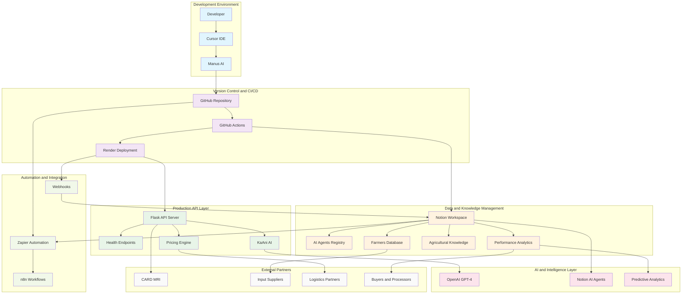
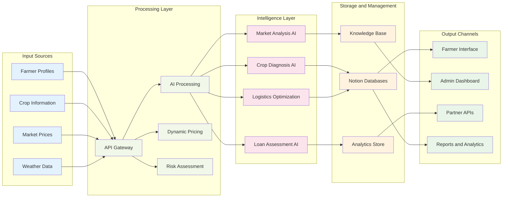
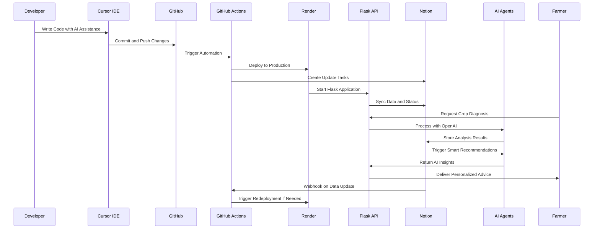
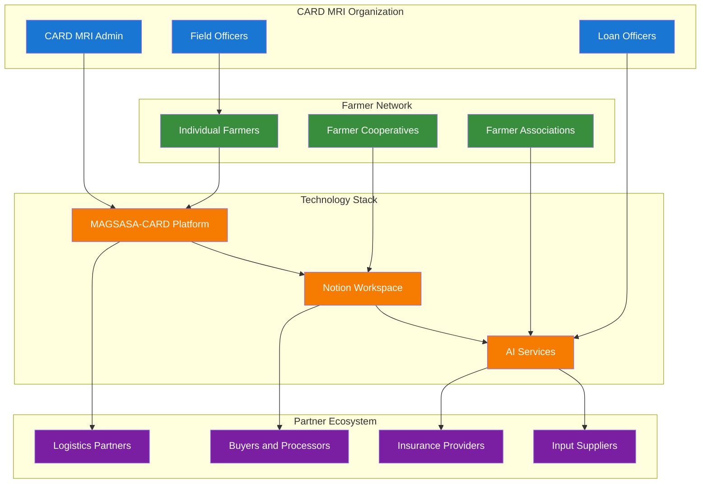
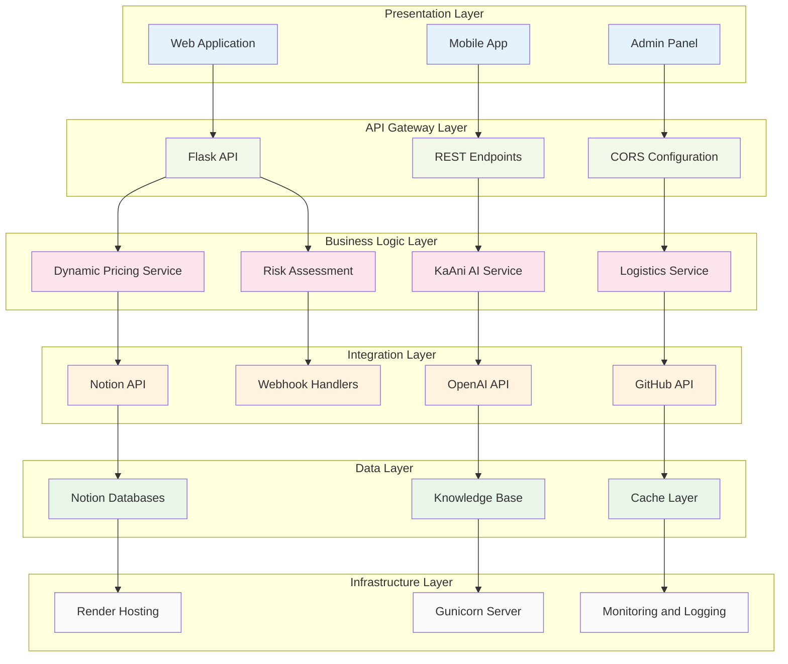
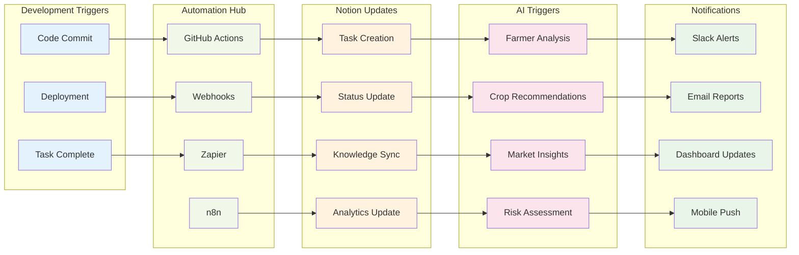

# MAGSASA-CARD Visual Technology Map
## Clean Architecture Diagrams

---

## 🏗️ **SYSTEM ARCHITECTURE OVERVIEW**

---

## 🔄 **DATA FLOW ARCHITECTURE**

---

## 🔧 **INTEGRATION WORKFLOW**

---

## 🏢 **ORGANIZATIONAL STRUCTURE**

---

## 📊 **TECHNOLOGY STACK LAYERS**

---

## 🔄 **AUTOMATION WORKFLOW**

