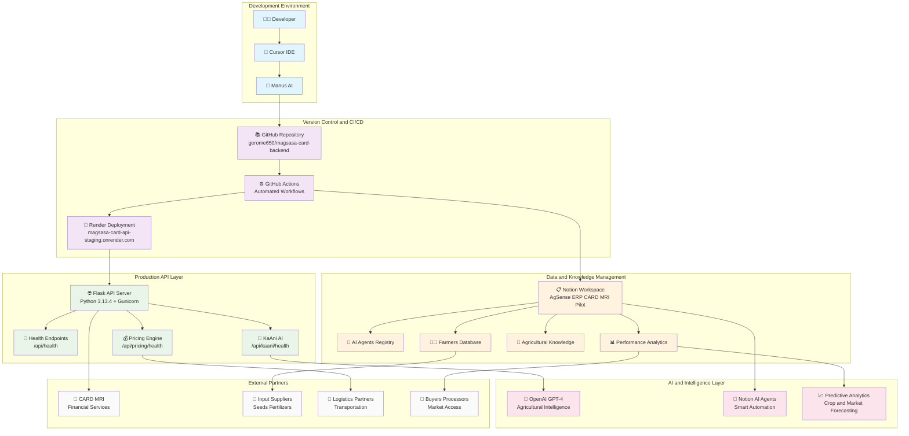

# MAGSASA-CARD System Overview
## High-Level Architecture

```mermaid
graph TB
    subgraph "Development Environment"
        DEV[👨‍💻 Developer]
        CURSOR[🎯 Cursor IDE]
        MANUS[🤖 Manus AI]
    end

    subgraph "Version Control and CI/CD"
        GITHUB[📚 GitHub Repository<br/>gerome650/magsasa-card-backend]
        ACTIONS[⚙️ GitHub Actions<br/>Automated Workflows]
        RENDER[🚀 Render Deployment<br/>magsasa-card-api-staging.onrender.com]
    end

    subgraph "Production API Layer"
        API[🌐 Flask API Server<br/>Python 3.13.4 + Gunicorn]
        HEALTH[💚 Health Endpoints<br/>/api/health]
        PRICING[💰 Pricing Engine<br/>/api/pricing/health]
        KAANI[🧠 KaAni AI<br/>/api/kaani/health]
    end

    subgraph "Data and Knowledge Management"
        NOTION[📋 Notion Workspace<br/>AgSense ERP CARD MRI Pilot]
        AIREGISTRY[🤖 AI Agents Registry]
        ANALYTICS[📊 Performance Analytics]
        KNOWLEDGE[🌾 Agricultural Knowledge]
        FARMERS[👨‍🌾 Farmers Database]
    end

    subgraph "AI and Intelligence Layer"
        OPENAI[🧠 OpenAI GPT-4<br/>Agricultural Intelligence]
        NOTIONAI[🤖 Notion AI Agents<br/>Smart Automation]
        PREDICTIONS[📈 Predictive Analytics<br/>Crop and Market Forecasting]
    end

    subgraph "External Partners"
        CARDMRI[🏦 CARD MRI<br/>Financial Services]
        SUPPLIERS[🌱 Input Suppliers<br/>Seeds Fertilizers]
        LOGISTICS[🚛 Logistics Partners<br/>Transportation]
        BUYERS[🏪 Buyers Processors<br/>Market Access]
    end

    %% Development Flow
    DEV --> CURSOR
    CURSOR --> MANUS
    MANUS --> GITHUB
    
    %% CI/CD Pipeline
    GITHUB --> ACTIONS
    ACTIONS --> RENDER
    RENDER --> API
    
    %% API Services
    API --> HEALTH
    API --> PRICING
    API --> KAANI
    
    %% Data Integration
    ACTIONS --> NOTION
    NOTION --> AIREGISTRY
    NOTION --> ANALYTICS
    NOTION --> KNOWLEDGE
    NOTION --> FARMERS
    
    %% AI Integration
    KAANI --> OPENAI
    NOTION --> NOTIONAI
    ANALYTICS --> PREDICTIONS
    
    %% External Integrations
    API --> CARDMRI
    FARMERS --> SUPPLIERS
    PRICING --> LOGISTICS
    ANALYTICS --> BUYERS

    %% Styling
    classDef development fill:#e1f5fe
    classDef cicd fill:#f3e5f5
    classDef production fill:#e8f5e8
    classDef data fill:#fff3e0
    classDef ai fill:#fce4ec
    classDef external fill:#fafafa

    class DEV,CURSOR,MANUS development
    class GITHUB,ACTIONS,RENDER cicd
    class API,HEALTH,PRICING,KAANI production
    class NOTION,AIREGISTRY,ANALYTICS,KNOWLEDGE,FARMERS data
    class OPENAI,NOTIONAI,PREDICTIONS ai
    class CARDMRI,SUPPLIERS,LOGISTICS,BUYERS external
```
