# MAGSASA-CARD Tech Stack Bottlenecks & Optimization Analysis
## Performance, Scalability & Risk Assessment

---

## 🚨 **CRITICAL BOTTLENECKS IDENTIFIED**

### **1. Single Point of Failure - Render Hosting**

```mermaid
graph LR
    GITHUB[GitHub Repository] --> RENDER[🚨 Render Single Instance]
    RENDER --> API[Flask API]
    API --> FARMERS[👨‍🌾 All Farmers]
    
    style RENDER fill:#ffcdd2
```

**Risk Level**: 🔴 **HIGH**
- **Issue**: All farmer traffic routes through single Render instance
- **Impact**: If Render goes down, entire MAGSASA-CARD platform is offline
- **Affected Users**: All farmers, CARD MRI staff, partners
- **Downtime Cost**: Complete service interruption

**Optimization Solutions**:
- **Load Balancer**: Implement multiple Render instances behind load balancer
- **Multi-Cloud Strategy**: Deploy to AWS/GCP as backup
- **Health Monitoring**: Real-time uptime monitoring with alerts
- **Failover System**: Automatic switching to backup instances

---

### **2. Notion API Rate Limiting**

```mermaid
graph TB
    subgraph "High Volume Operations"
        FARMERS[1000+ Farmers] --> API[Flask API]
        COMMITS[Frequent Commits] --> ACTIONS[GitHub Actions]
        AI_REQUESTS[AI Analysis] --> OPENAI[OpenAI API]
    end
    
    subgraph "Bottleneck Zone"
        API --> NOTION_API[🚨 Notion API<br/>Rate Limited]
        ACTIONS --> NOTION_API
        OPENAI --> NOTION_API
    end
    
    NOTION_API --> NOTION_DB[Notion Database]
    
    style NOTION_API fill:#ffcdd2
```

**Risk Level**: 🟡 **MEDIUM-HIGH**
- **Issue**: Notion API has rate limits (3 requests/second for integrations)
- **Impact**: Data sync delays, failed operations during peak usage
- **Scaling Problem**: Won't handle 1000+ farmers making simultaneous requests

**Optimization Solutions**:
- **Request Queue**: Implement Redis-based queue for Notion API calls
- **Batch Processing**: Group multiple operations into single API calls
- **Caching Layer**: Cache frequently accessed Notion data locally
- **Database Hybrid**: Use PostgreSQL for high-frequency data, Notion for management

---

### **3. Synchronous AI Processing**

```mermaid
sequenceDiagram
    participant FARMER as 👨‍🌾 Farmer
    participant API as Flask API
    participant OPENAI as OpenAI API
    participant NOTION as Notion
    
    FARMER->>API: Request Crop Diagnosis
    API->>OPENAI: 🚨 Synchronous AI Call (5-15 seconds)
    Note over API,OPENAI: Farmer waits...
    OPENAI->>API: AI Response
    API->>NOTION: 🚨 Synchronous Save (2-5 seconds)
    Note over API,NOTION: Farmer still waits...
    NOTION->>API: Confirmation
    API->>FARMER: Final Response
    
    Note over FARMER,NOTION: Total Wait Time: 7-20 seconds
```

**Risk Level**: 🟡 **MEDIUM**
- **Issue**: Farmers wait 7-20 seconds for AI responses
- **Impact**: Poor user experience, potential timeouts
- **Scaling Problem**: Can't handle concurrent AI requests efficiently

**Optimization Solutions**:
- **Async Processing**: Use Celery/Redis for background AI processing
- **WebSocket Updates**: Real-time progress updates to farmers
- **Response Caching**: Cache common crop diagnosis results
- **Progressive Responses**: Send immediate acknowledgment, then detailed results

---

### **4. Development Workflow Inefficiencies**

```mermaid
graph LR
    subgraph "Current Workflow"
        DEV[Developer] --> CURSOR[Cursor IDE]
        CURSOR --> GITHUB[GitHub]
        GITHUB --> RENDER[Render Deploy]
        RENDER --> TEST[🚨 Test in Production]
    end
    
    subgraph "Missing Components"
        STAGING[❌ No Staging Environment]
        TESTING[❌ No Automated Testing]
        MONITORING[❌ No Performance Monitoring]
    end
    
    style TEST fill:#ffcdd2
    style STAGING fill:#fff3e0
    style TESTING fill:#fff3e0
    style MONITORING fill:#fff3e0
```

**Risk Level**: 🟡 **MEDIUM**
- **Issue**: Testing directly in production environment
- **Impact**: Potential bugs affecting live farmers
- **Missing**: Staging environment, automated tests, monitoring

**Optimization Solutions**:
- **Staging Environment**: Deploy separate staging instance
- **Automated Testing**: GitHub Actions with pytest
- **Performance Monitoring**: New Relic or DataDog integration
- **Feature Flags**: Gradual rollout of new features

---

## ⚡ **PERFORMANCE OPTIMIZATION OPPORTUNITIES**

### **1. Database Architecture Enhancement**

**Current Performance**: 
- **Notion API**: 3 requests/second limit
- **Response Time**: 500ms-2s per request
- **Concurrent Users**: Limited to ~10-20

**Optimized Performance**:
- **PostgreSQL**: 1000+ requests/second
- **Redis Cache**: Sub-millisecond response
- **Concurrent Users**: 1000+ farmers simultaneously

**Implementation Priority**: 🔴 **HIGH** (Critical for scaling)

---

### **2. API Response Optimization**

```mermaid
graph LR
    subgraph "Current API Response"
        REQUEST[Farmer Request] --> PROCESS[🐌 Full Processing<br/>7-20 seconds]
        PROCESS --> RESPONSE[Complete Response]
    end
    
    subgraph "Optimized API Response"
        REQUEST2[Farmer Request] --> IMMEDIATE[⚡ Immediate ACK<br/>200ms]
        IMMEDIATE --> BACKGROUND[🔄 Background Processing]
        BACKGROUND --> WEBSOCKET[📡 WebSocket Update]
        WEBSOCKET --> COMPLETE[Complete Response]
    end
    
    style PROCESS fill:#ffcdd2
    style IMMEDIATE fill:#c8e6c9
    style WEBSOCKET fill:#c8e6c9
```

**Current Experience**:
- **Wait Time**: 7-20 seconds
- **User Experience**: Poor (farmers wait)
- **Timeout Risk**: High for slow connections

**Optimized Experience**:
- **Immediate Response**: 200ms acknowledgment
- **Progress Updates**: Real-time status via WebSocket
- **Background Processing**: No blocking operations

---

### **3. AI Processing Optimization**

```mermaid
graph TB
    subgraph "Current AI Processing"
        FARMER1[Farmer 1] --> API1[Flask API]
        FARMER2[Farmer 2] --> API1
        FARMER3[Farmer 3] --> API1
        API1 --> OPENAI1[🐌 Sequential OpenAI Calls]
    end
    
    subgraph "Optimized AI Processing"
        FARMER4[Farmer 1] --> API2[Flask API]
        FARMER5[Farmer 2] --> API2
        FARMER6[Farmer 3] --> API2
        API2 --> QUEUE[⚡ AI Queue]
        QUEUE --> WORKER1[AI Worker 1]
        QUEUE --> WORKER2[AI Worker 2]
        QUEUE --> WORKER3[AI Worker 3]
        WORKER1 --> OPENAI2[OpenAI API]
        WORKER2 --> OPENAI2
        WORKER3 --> OPENAI2
    end
    
    style OPENAI1 fill:#ffcdd2
    style QUEUE fill:#c8e6c9
    style WORKER1 fill:#c8e6c9
    style WORKER2 fill:#c8e6c9
    style WORKER3 fill:#c8e6c9
```

**Current Limitations**:
- **Concurrent Processing**: 1 request at a time
- **Queue Management**: None (requests can be lost)
- **Scalability**: Limited to single-threaded processing

**Optimized Capabilities**:
- **Parallel Processing**: Multiple AI workers
- **Queue Management**: Redis-based job queue
- **Auto-scaling**: Add workers based on demand

---

## 🔒 **SECURITY & RELIABILITY BOTTLENECKS**

### **1. API Key Management**

```mermaid
graph LR
    subgraph "Current Setup"
        RENDER[Render Environment] --> OPENAI_KEY[🚨 OpenAI Key<br/>Single Point]
        RENDER --> NOTION_KEY[🚨 Notion Token<br/>Single Point]
    end
    
    subgraph "Secure Setup"
        VAULT[🔒 HashiCorp Vault] --> ROTATE[Key Rotation]
        VAULT --> MULTIPLE[Multiple API Keys]
        VAULT --> MONITORING[Usage Monitoring]
    end
    
    style OPENAI_KEY fill:#ffcdd2
    style NOTION_KEY fill:#ffcdd2
    style VAULT fill:#c8e6c9
```

**Risk Level**: 🟡 **MEDIUM**
- **Issue**: Single API keys for critical services
- **Impact**: If key is compromised, entire system at risk
- **Missing**: Key rotation, usage monitoring, backup keys

**Optimization Solutions**:
- **Key Rotation**: Automated monthly key rotation
- **Multiple Keys**: Load balance across multiple OpenAI keys
- **Usage Monitoring**: Track API usage and anomalies
- **Secrets Management**: Use HashiCorp Vault or AWS Secrets Manager

---

### **2. Error Handling & Recovery**

```mermaid
graph TB
    subgraph "Current Error Handling"
        ERROR[API Error] --> FAIL[🚨 Complete Failure]
        FAIL --> FARMER_LOST[👨‍🌾 Farmer Loses Request]
    end
    
    subgraph "Resilient Error Handling"
        ERROR2[API Error] --> RETRY[🔄 Automatic Retry]
        RETRY --> FALLBACK[🛡️ Fallback Response]
        FALLBACK --> QUEUE_LATER[📝 Queue for Later]
        QUEUE_LATER --> SUCCESS[✅ Eventually Consistent]
    end
    
    style FAIL fill:#ffcdd2
    style FARMER_LOST fill:#ffcdd2
    style RETRY fill:#c8e6c9
    style FALLBACK fill:#c8e6c9
```

**Current Issues**:
- **No Retry Logic**: Failed requests are lost
- **No Fallback**: System fails completely on errors
- **No Recovery**: Manual intervention required

**Resilient Solutions**:
- **Exponential Backoff**: Automatic retry with delays
- **Circuit Breaker**: Prevent cascade failures
- **Graceful Degradation**: Provide basic service when AI is down
- **Dead Letter Queue**: Capture and retry failed requests

---

## 📊 **SCALABILITY BOTTLENECKS**

### **1. Farmer Growth Projection**

```mermaid
graph LR
    subgraph "Current Capacity"
        CURRENT[100 Farmers<br/>✅ Working]
    end
    
    subgraph "6 Month Projection"
        PROJECTED[1000 Farmers<br/>🚨 Will Break]
    end
    
    subgraph "12 Month Projection"
        FUTURE[5000 Farmers<br/>🔴 Complete Failure]
    end
    
    CURRENT --> PROJECTED
    PROJECTED --> FUTURE
    
    style PROJECTED fill:#fff3e0
    style FUTURE fill:#ffcdd2
```

**Breaking Points**:
- **100-500 Farmers**: Notion API rate limiting kicks in
- **500-1000 Farmers**: Response times become unacceptable
- **1000+ Farmers**: System becomes unusable

**Scaling Solutions**:
- **Database Migration**: PostgreSQL for farmer data
- **Microservices**: Separate services for different functions
- **Auto-scaling**: Horizontal scaling based on load
- **CDN**: Content delivery network for static assets

---

### **2. Geographic Distribution**

```mermaid
graph TB
    subgraph "Current Architecture"
        FARMERS_LUZON[👨‍🌾 Luzon Farmers] --> RENDER_US[🚨 Render US East<br/>High Latency]
        FARMERS_VISAYAS[👨‍🌾 Visayas Farmers] --> RENDER_US
        FARMERS_MINDANAO[👨‍🌾 Mindanao Farmers] --> RENDER_US
    end
    
    subgraph "Optimized Architecture"
        FARMERS_LUZON2[👨‍🌾 Luzon Farmers] --> CDN_ASIA[⚡ Asia Pacific CDN]
        FARMERS_VISAYAS2[👨‍🌾 Visayas Farmers] --> CDN_ASIA
        FARMERS_MINDANAO2[👨‍🌾 Mindanao Farmers] --> CDN_ASIA
        CDN_ASIA --> API_ASIA[🚀 Asia Pacific API]
    end
    
    style RENDER_US fill:#ffcdd2
    style CDN_ASIA fill:#c8e6c9
    style API_ASIA fill:#c8e6c9
```

**Current Latency Issues**:
- **Philippines to US East**: 200-400ms base latency
- **Rural Connections**: Additional 100-300ms
- **Total Response Time**: 500ms-1s just for network

**Geographic Optimization**:
- **Asia Pacific Deployment**: Reduce latency to 50-100ms
- **Edge Caching**: Cache responses closer to farmers
- **Progressive Web App**: Offline capability for poor connections

---

## 🎯 **OPTIMIZATION PRIORITY MATRIX**

### **🔴 CRITICAL (Implement Immediately)**
| Issue | Impact | Effort | Timeline |
|-------|--------|--------|----------|
| **Single Point of Failure** | Very High | Medium | 1 week |
| **Database Performance** | Very High | High | 2 weeks |
| **Async AI Processing** | High | Medium | 1 week |

### **🟡 HIGH PRIORITY (Next Month)**
| Issue | Impact | Effort | Timeline |
|-------|--------|--------|----------|
| **Notion API Rate Limiting** | High | Medium | 2 weeks |
| **Error Handling** | High | Low | 1 week |
| **Staging Environment** | Medium | Low | 3 days |

### **🟢 MEDIUM PRIORITY (Next Quarter)**
| Issue | Impact | Effort | Timeline |
|-------|--------|--------|----------|
| **Geographic Distribution** | Medium | High | 1 month |
| **Security Enhancement** | Medium | Medium | 2 weeks |
| **Monitoring & Alerting** | Medium | Low | 1 week |

---

## 🚀 **RECOMMENDED OPTIMIZATION ROADMAP**

### **Phase 1: Stability & Reliability (Week 1-2)**
1. **Multi-Instance Deployment**
   - Deploy 2-3 Render instances
   - Implement load balancing
   - Set up health monitoring

2. **Database Optimization**
   - Add PostgreSQL for high-frequency data
   - Implement Redis caching
   - Keep Notion for management interface

3. **Async Processing**
   - Implement Celery for background tasks
   - Add Redis job queue
   - WebSocket for real-time updates

### **Phase 2: Performance & Scalability (Week 3-4)**
1. **API Optimization**
   - Implement request batching
   - Add response caching
   - Optimize database queries

2. **Error Resilience**
   - Add retry logic with exponential backoff
   - Implement circuit breakers
   - Create fallback responses

3. **Monitoring & Alerting**
   - Set up performance monitoring
   - Create alerting for critical issues
   - Implement logging and analytics

### **Phase 3: Advanced Optimization (Month 2)**
1. **Geographic Distribution**
   - Deploy Asia Pacific instances
   - Implement CDN for static assets
   - Add edge caching

2. **Security Enhancement**
   - Implement key rotation
   - Add secrets management
   - Enhance API security

3. **Advanced Features**
   - Implement auto-scaling
   - Add A/B testing capability
   - Create advanced analytics

---

## 💡 **IMMEDIATE ACTION ITEMS**

### **This Week (Critical)**
1. **Set up staging environment** (3 hours)
2. **Implement basic error handling** (4 hours)
3. **Add health monitoring** (2 hours)
4. **Create backup deployment** (6 hours)

### **Next Week (High Priority)**
1. **Add PostgreSQL database** (8 hours)
2. **Implement Redis caching** (6 hours)
3. **Set up async processing** (12 hours)

### **Month 1 (Medium Priority)**
1. **Geographic optimization** (2 weeks)
2. **Advanced monitoring** (1 week)
3. **Security enhancements** (1 week)

---

## 📈 **EXPECTED PERFORMANCE IMPROVEMENTS**

### **After Phase 1 Optimizations**
- **Response Time**: 7-20s → 200ms-2s
- **Concurrent Users**: 10-20 → 100-200
- **Uptime**: 95% → 99.5%
- **Error Rate**: 5-10% → <1%

### **After Phase 2 Optimizations**
- **Response Time**: 200ms-2s → 50-500ms
- **Concurrent Users**: 100-200 → 500-1000
- **Uptime**: 99.5% → 99.9%
- **Geographic Latency**: 500ms → 100ms

### **After Phase 3 Optimizations**
- **Response Time**: 50-500ms → 20-200ms
- **Concurrent Users**: 500-1000 → 5000+
- **Uptime**: 99.9% → 99.99%
- **Global Performance**: Optimized for Philippines

---

*This analysis provides a comprehensive roadmap for optimizing your MAGSASA-CARD platform from the current proof-of-concept to a production-ready system capable of serving thousands of Filipino farmers efficiently and reliably.*
